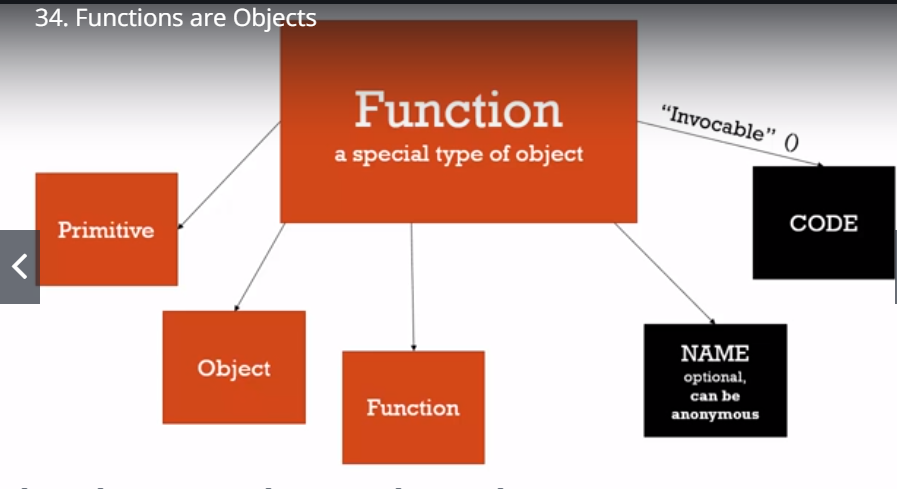
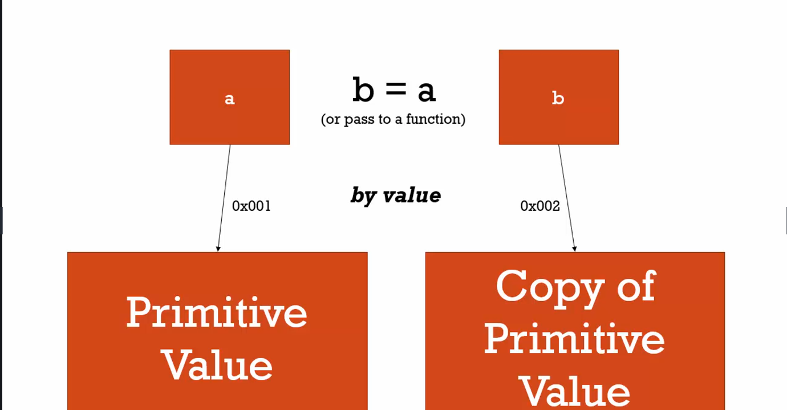
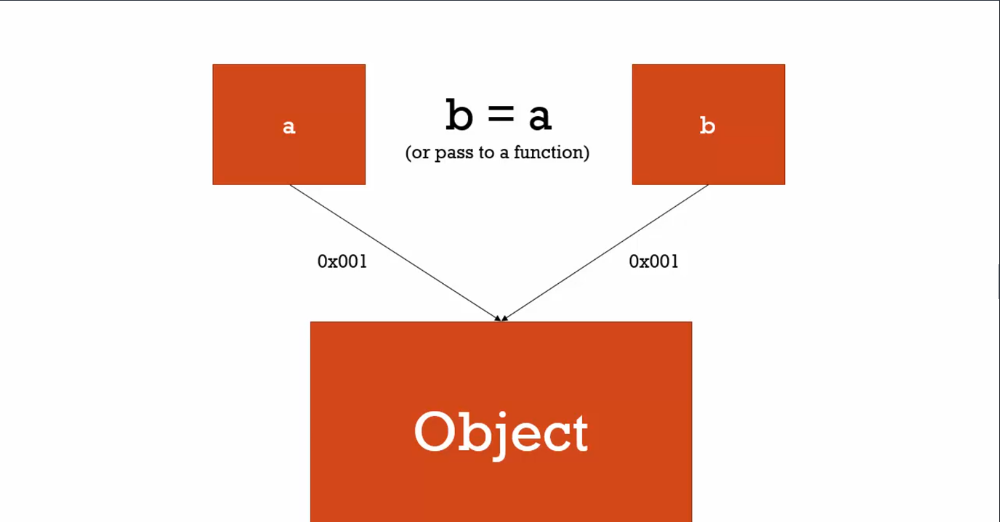

# Section 4 
## Objects and Functions
Objects and functions are not distinct in javascript
***
## Objects and the dot
* Objects can have things connected
  * Primitive 'property'
  * Object 'property'
  * Object 'method'
    * Methods are functions that belong to an object
* Object properties can be accessed multiple ways
  * Computed Member Access i.e. []
    * Brackets are an operator
    * Third in Operator Precedenct
    * They're useful because a variable can access the property:
    ```javascript
    person['firstname'] = "Tony" // firstname is a property of person
    person['lastname'] = "Alicea" // lastname is a property of person

    var firstNameProperty = "firstname"
    console.log(person[firstNameProperty])

    Tony
    ```
  * Dot operator
    * `person.firstname = 'Mike'`
    * second in Operator Precedence (behind grouping i.e. ())

## Objects and Object Literals
`var person = {}` is the same as `var person = new Object()`

```
var person = {
    firstname: 'Tony',
    lastname: 'Alicea',
    address: {
        street: '111 Main St.',
        city: 'New York',
        state: 'NY',
    }
}
```

## Faking namespace
* Namespace is a container for variables and functions
* Javascript doesn't have namespaces
* Objects can be used to prevent namespace collisions:
```javascript
var greet = 'Hello!'
var greet = 'Hola!'
```

```javascript
var english = {}
var spanish = {}
english.greet = 'Hello!'
spanish.greet = 'Hola!'
```
* Object literals can build objects easier than building using dot notation:
```javascript
var spanish.greetings.greet = 'Hello!' // Uncaught TypeError: Cannot set property 'greet' of undefined

// This, however, works
var spanish = { 
    greetings:{
        greet:'Hello',
    }
}
```

## JSON and Object Literals
* JSON and Object Literals are not the same thing
```javascript
// This is correct JS
{
    firstname:"Mary",
    isAProgrammer: true
}
```
```json
// But JSON Properties must be wrapped in quotes:
{
    "firstname":"Mary",
    "isAProgrammer": true
}
```

## Functions are Objects
* First Class Functions
  * Everything you can do with other types, you can do with functions
  * Assign them to variables, pass them around, create them on the fly
  * Function is a special type of object
  * Function Name is optional. It can be anonymous
  * Function Code is invocable

  
  * Functions can have parameters added
  ```javascript
  function greet() {
      console.log('hi')
  }
  greet.language = 'english'
  ```

## Function Statements and Function Expressions
* Expression is a unit of code that results in a value
* Statements just do work
```javascript
// This is a function statement
// Nothing is returned
function greet(){
    console.log('hi')
}
```

```javascript
var anonymousGreet = function(){
    console.log('Hello')
    // This is an anonymous function
    // It is also a function expression,
    // because it is returned to
    // var anonymousGreet
}

anonymousGreet() // Calls the function
```

* Because functions are first class citizens, they can be passed around:

```javascript
function log(a) {
    console.log(a)
}

log(1)
log('hope')
log(function(){
    console.log("Save me Obi Won")
})
```

```javascript
>1
>hope
>ƒ (){
    console.log("Save me Obi Won")
}
```
And functions can be handed to functions to run:

```javascript
function log(a) {
    a()
}

log(function(){
    console.log("Save me Obi Won")
})
```

## By Value vs By Reference
* Primitive values are passed by value:

* Objects are passed by reference

* **All primitives are passed by value**
* **All objects are passed by reference**

## Objects, Functions and 'this'

```javascript
console.log(this) // points to global object

function a(){
    console.log(this)
}

var b = () => {
    console.log(this)
}
a(); // points to global object
b(); // also points to global object
```

However, when a function is part of an object (a method), this returns the object the method belongs to:
```javascript
var c = {
    name:"The c object",
    log: function(){
    console.log(this)
    }
}

c.log()

> {name: "The c object", log: ƒ}
```

**The 'this' inside a function in a method references the global this** *shrug*

A common tactic is to `var self = this;` and then use self:
```javascript
var c = {
    name:"The c object",
    log: function(){
    var self = this
    self.name = 'Updated c object'
    console.log(self)
    
    var setname = function(newname){
        self.name = newname
    }
    setname('Updated again! The c object')
    console.log(self)
    }
         
}
```

## Arrays, collections of anything


## Arguments and ...spread
* Javascript gives a keyword: argument
* The argument object looks like an array but is not an array

## Function Overloading
* Does not exist in Javascript because functions are objects

## Syntax Parsers

## Automatic Semicolon insertion
* Javascript automatically inserts semicolons where it thinks they belong
* This can cause problems

## Whitespace: 
Invisible characters that create literal 'space' in your written code
* Javascript is very friendly to white-space
* Use it

## Immediately Invoked Function Expressions (IIFE)s
```javascript
//function statement
function greet(name){
    console.log('Hello ' + name)
}
greet();

// using a function expression
var greetFunc = function(name) {
    console.log('Hello ' + name)
}
greetFunc();

 // using an IIFE
var greeting = function(name) {
    console.log('Hello ' + name)
}();  // <-----

(function(name){
    var greeting = 'Helloooo '
    console.log(greeting + name);
    // return greeting + name;
}())
```

## Understanding Closures
* Closures are confusing
* Functions have access to variables in their exection context
```javascript
// The innner function has access to i.
function outer(){
    var i = 0;
    return function(){
        console.log('The outer i value is: ' +i)
    }
}
var j = outer()

j() == 'The outer i value is: 0'
// Even though outer has run and no longer exists,
// The inner function still refers to the i variable
```
* Closures can be used to make variables private
* Function factories

## Closures and Callbacks
* Callback Function
* A function you give to another function, to be run when the other function is finished

## Call(), Apply(), Bind()
* Applicable to 'this'
* Available to all functions
* Call acts like (). You can give it an object to act as this
* Apply is similar to call but arguments are passed in as a list
```javascript
var person = {
    firstname: 'John',
    lastname: 'Doe',
    getFullName: function(){
        var fullname = `${this.firstname} ${this.lastname}`;
        return fullname 
    }
}
var logName = function(lang1, lang2){
    console.log(`Logged: ${this.getFullName()}`)
    console.log(`Arguments: ${lang1}, ${lang2}`)
    console.log('----------------')
}
var logPersonName = logName.bind(person);
logPersonName('en','es')
logName.call(person, 'russian','swedish')
logName.apply(person, ['deutsch', 'francais'])

```
## Functional Programming
* ### Function Borrowing
* ### Function Currying
WTF. Don't fucking know. I believe that ecma 6 added so much functionality to js that half the shit in the functional programming section has been implemented.
Interesting. I need to come back here when i have a better grasp

